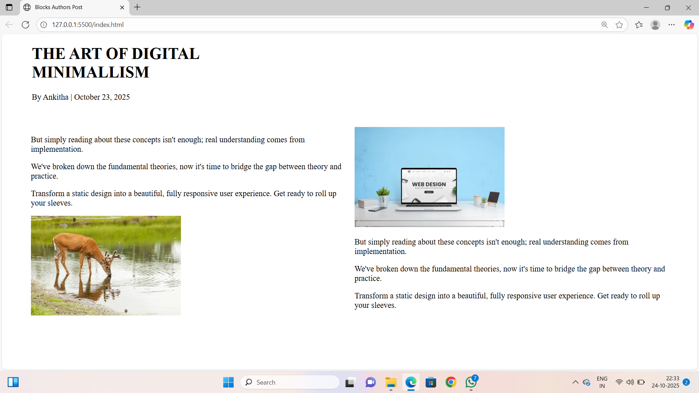

# 📝 Blog Post Layout

A simple and responsive **Blog Post Layout** website built using **HTML, CSS, and JavaScript**.  
It features a clean design for displaying blog posts, including post previews, author information, and easy navigation — perfect for personal blogs or portfolio projects.

---

## 🚀 Features

- 📰 Clean and modern blog post layout  
- 📱 Fully responsive design (mobile & desktop friendly)  
- 👤 Author and date information display  
- 💬 Comment section (optional/additional)  
- 🖼️ Image and text formatting for better readability  
- 🌐 Easy to customize for your own blog

---

## 🛠️ Technologies Used

- **HTML5** – Structure and content  
- **CSS3** – Styling and layout  
- **JavaScript** – Interactivity (optional)  
- *(Optional)* Bootstrap or TailwindCSS – for faster UI design  

---

## 📸 Screenshots

### 🖼️ Homepage Preview


### 📝 Blog Post Preview


---

## 🔗 Live Demo

👉 [Click here to view the live demo](http://127.0.0.1:5500/index.html)  

---

## ⚙️ Setup Instructions

Follow these steps to run the project locally:

```bash
# 1. Clone the repository
git clone https://github.com/your-username/blog-post-layout.git

# 2. Open the project folder
cd blog-post-layout

# 3. Open index.html in your browser
